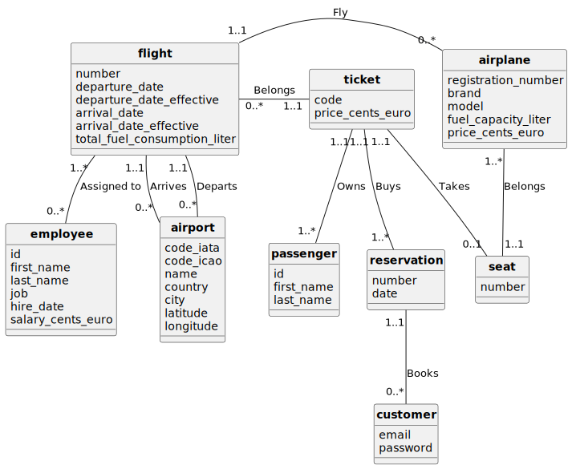

# CNAM Base de données - Réalisation d'une base de données d'une compagnie aérienne

## À propos

Projet libre réalisé dans le cadre de la formation [Ingénieur en Informatique et Systèmes d'Information (SI), CNAM](https://www.itii-alsace.fr/formations/informatique-et-systemes-dinformation-le-cnam/), pour le module Base De Données (BDD). Le sujet du projet. se trouve dans le fichier [SUJET.md](SUJET.md).

### Membres du groupe

- [Quentin BRENNER](https://github.com/OneLiberty)
- [Théo LUDWIG](https://gitlab.com/theoludwig)

### Tables des matières

- [Cahier des charges](#cahier-des-charges)
- [Modèle Conceptuel de Données (MCD)](#modèle-conceptuel-de-données-mcd)
- [Modèle Logique de Données (MLD)](#modèle-logique-de-données-mld)
- [Justification des choix de conception](#justification-des-choix-de-conception)

Afin de tester les requếtes nous avons mis en place des scripts pour générer des données réalistes (provenant de <https://airportdb.io>) et créer automatiquement des scripts d'insertions en SQL (situé dans le dossier [`sql/inserts`](./sql/inserts)), plus d'informations à propos de ces scripts se trouvent dans le fichier [SCRIPT.md](SCRIPT.md).

Le script de création des tables est [`sql/tables_creation.sql`](./sql/tables_creation.sql).

Les scénarios du cahier des charges sont numérotés, chaque scénario est implémenté dans un script SQL situé dans le dossier [`sql/queries`](./sql/queries). Chaque script est nommé `query_<numéro_du_scénario>.sql`, par exemple le scénario 1 est implémenté dans le fichier [`sql/queries/query_1.sql`](./sql/queries/query_1.sql).

## Cahier des charges

### Contexte

Une nouvelle compagnie française **BRENNER/LUDWIG Airlines** arrive sur la marché des transports aérien en proposant un grand nombre nombre de destinations au départ de nombreux aéroports.

Elle intègre un milieu très concurrentiel et doit se démarquer par la qualité de ses services et prestations.

### Objectifs et public visé

L'objectif du projet est de gérer les vols d'une compagnie aérienne en proposant une base de données permettant de stocker les informations relatives aux vols, aux avions, aux passagers, aux aéroports, aux employés (pilotes, hôtes/hôtesses, agents de ticketeries), aux réservations, aux prix.

La finalité sera d'optimiser les coûts, les ressources et les revenus de la compagnie aérienne, et de fournir des informations cruciales pour la prise de décision aux différents acteurs de la compagnie.

### Terminologie

Aucune terminologie particulière n'est necessaire pour comprendre le projet.

### Scénarios

1. Paul doit prendre un vol de Paris à Los Angeles. Il consulte les horaires des vols. Il réserve le vol, et un siège.
2. Nombre de vols effectués + nombre d'heures de vol d'un pilote. Permet de savoir si un copilote peut devenir commandant de bord. => Le chef des pilotes consulte les heures de vol des copilotes pour identifier ceux qui peuvent devenir commandants de bord avec le nombre d'heures de vol requis.
3. Nombre de places occupés pour un vol donné. => Un agent vérifie le taux d'occupation du vol 8784 de Paris à Los Angeles.
4. Capacité moyenne des Airbus/Boeing, et la moyenne de consommation de kérozène en litre par heure, pour voir lequel consomme le plus. => Le responsable des ventes consulte la capacité moyenne des Airbus et des Boeing pour savoir si les avions sont rentables, et ajuster les destinations des vols.
5. Combien de villes différentes ont été visitées par un pilote => 'Michèle LEGRAND' va prendre sa retraite et souhaite connaitre toutes les destination qu'il a pu visiter en tant que pilote, nostalgie.
6. Classement des vols les plus remplis (avec le plus de passagers). => La compagnie demande à son responsable des ventes de faire un rapport sur l'occupation des petites lignes pour décider celles qu'il faudrait supprimer et identifier les vols atteignant systématiquement leur capacité maximale et planifie l'ajout d'appareils plus grands sur ces lignes.
7. Le directeur, aimerait savoir si les avions décolle et attérit à l'heure, ou si il y a des retards, afin de prendre des mesures pour améliorer la ponctualité des vols et les prédictions de temps de vol.
8. Gestion des employés de la compagnie (Hotesse de l'air, pilotes, agent de piste, agents de ticketerie, etc). Savoir qui est le pilote principal/copilote d'un vol, hôtesses de l'air présentes sur un vol, agents de ticketeries/qui s'ocuppe de prendre les valises d'un vol. Pour chaque fonction (job), donner le nombre d'employés qui l'exercent et le salaire moyen, minimum, maximum. Quelles sont les fonctions pour lesquelles travaillent le plus de personnes, où travaille + de 10 personnes? => La direction consulte la base de données pour connaître le nombre d'hôtesses de l'air, pilotes et agents de ticketterie. Elle ajuste les effectifs en prévision des périodes de forte affluence. => Un client s'est plaint du comportement d'une hôtesse de l'air durant son vol (AF123), le manager a besoin de retrouver les informations de l'employée pour en discuter.
9. Nombre de kilomètres parcourus par un avion, en fonction des vols effectués. En sachant qu'un vol stocke l'aéroport de départ et aéroport d'arrivée. Et que chaque aéroport a une latitude et une longitude.

### La quantité de données

- Nombre d'avion dans la compagnie: 135
- Nombre d'employés: 2 321 (496 pilotes, 668 personnels de cabine, 1 157 personnels au sol)
- Nombre d'aéroports: 22
- Nombre de vols enregistrés : 1 000
- Nombre de passagers enregistrés : 100 000

## Modèle Conceptuel de Données (MCD)

### Relations

- Airplane <-> Flight
  - Un **avion** peut effectuer zéro ou plusieurs **vols**.
  - Un **vol** est effectué par un et un seul **avion**.
- Seat <-> Airplane
  - Un **siège** appartient à un et un seul **avion**.
  - Un **avion** est composé d'un ou plusieurs **sièges**.
- Employee <-> Flight
  - Un **employé** peut être affecté à zéro ou plusieurs **vols**.
  - Un **vol** est effectué par un ou plusieurs **employés** (pilotes, hôtesses, etc.).
- Passenger <-> Ticket
  - Un **passager** peut posséder un ou plusieurs **tickets** (pour plusieurs vols).
  - Un **ticket** est détenu par un et un seul **passager**.
- Flight <-> Ticket
  - Un **vol** est associé à zéro ou plusieurs **tickets**.
  - Un **ticket** concerne un et un seul **vols**.
- Reservation <-> Ticket
  - Une **réservation** peut être associée à un ou plusieurs **tickets**.
  - Un **ticket** est lié à une et une seule **réservation**.
- Ticket <-> Seat
  - Un **ticket** correspond à un et un seul **siège**.
  - Un **siège** peut être occupé par zéro ou un **ticket**.
- Flight <-> Airport
  - Un **vol** part d'un et un seul **aéroport**.
  - Un **vol** arrive à un et un seul **aéroport**.
  - Un **aéroport** peut être le lieu de départ et d'arrivé de zéro ou plusieurs vols.
- Customer <-> Reservation
  - Un **client** peut faire zéro ou plusieurs **réservations**.
  - Une **réservation** est faite par un et un seul **client**.

## Modèle Logique de Données (MLD)

- **airplane**(<u>registration_number</u>, brand, model, fuel_capacity_liter, price_cents_euro)
- **airport**(<u>code_iata</u>, code_icao, name, country, city, latitude, longitude)
- **customer**(<u>email</u>, password)
- **employee**(<u>id</u>, first_name, last_name, job, hire_date, salary_cents_euro)
- **flight**(<u>number</u>, departure_date, arrival_date, arrival_date_effective, departure_date_effective, total_fuel_consumption_liter, #arrival_airport, #departure_airport, #airplane_number)
- **flight_employee**(<u>#flight_number, #employee_id</u>)
- **passenger**(<u>id</u>, first_name, last_name)
- **reservation**(<u>number</u>, date, #customer_email)
- **seat**(<u>number, #airplane_registration_number</u>)
- **ticket**(<u>code</u>, price_cents_euro, #passenger_id, #reservation_number, #seat_number, #seat_airplane_registration_number, #flight_number)

### Légendes

- <u>souligné</u> : Clé primaire
- `#` : Clé étrangère

## Justification des choix de conception

- Nous avons décidé de créer une table à part pour les sièges (`seat`) plutôt que de juste avoir un nombre de place dans l'avion afin de pouvoir gérer les places disponibles dans l'avion, et de pouvoir associer un siège à un ticket. Aussi, nous avons fait le choix que chaque avion a ses propres sièges, ce qui permet de gérer les différences de configuration entre les avions. Même un avion de la même marque et du même modèle peut avoir une configuration différente, par exemple un Airbus A320 peut avoir 150 sièges dans une configuration, et 180 dans une autre.
- Nous avons séparer passager et client, car on peut imaginer que le site de la compagnie permet de réserver des vols avec un compte (le client), et que les passagers, peuvent être sa famille, des amis (ou autre dans le cas de voyage d'affaire d'entreprise), etc.
- Les informations des passagers peuvent être réutilisées pour d'autres réservations/vols, c'est pourquoi nous avons créé une table `passenger` séparée de la table `ticket`.
- Nous avons la date de départ prévue et la date de départ effective, car il peut y avoir des retards, et nous avons besoin de savoir si le vol est parti à l'heure ou non. De même pour l'arrivée.
- Nous avons décidé de stocker les prix en centimes d'euros pour éviter les problèmes de précision avec les nombres à virgule flottante.
